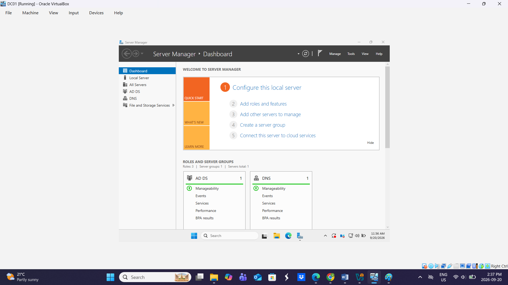
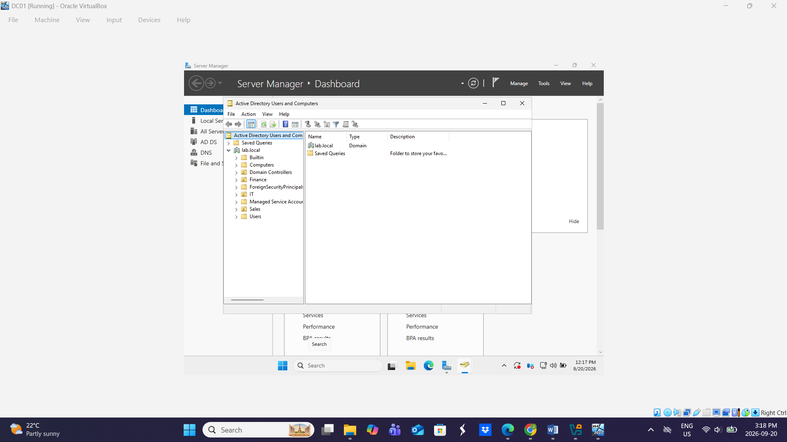
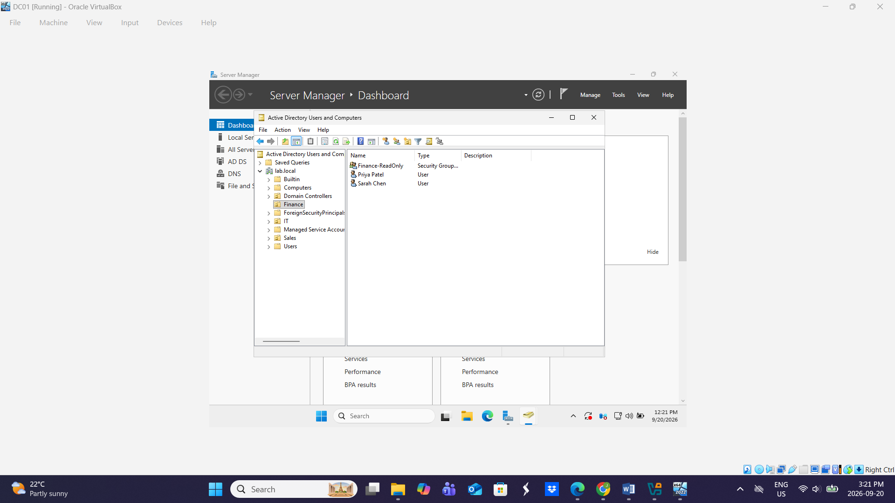
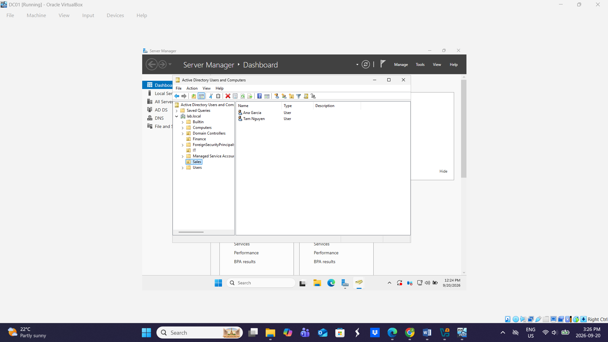
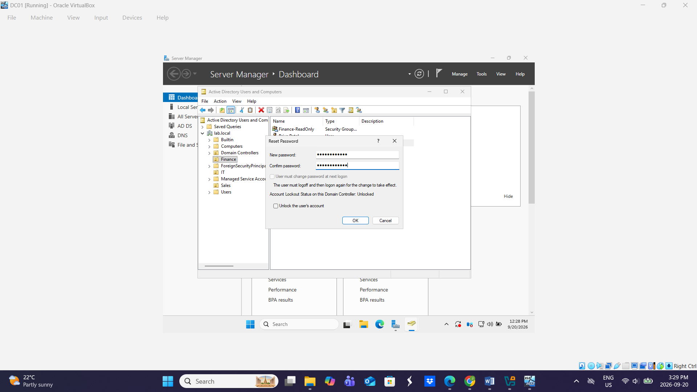
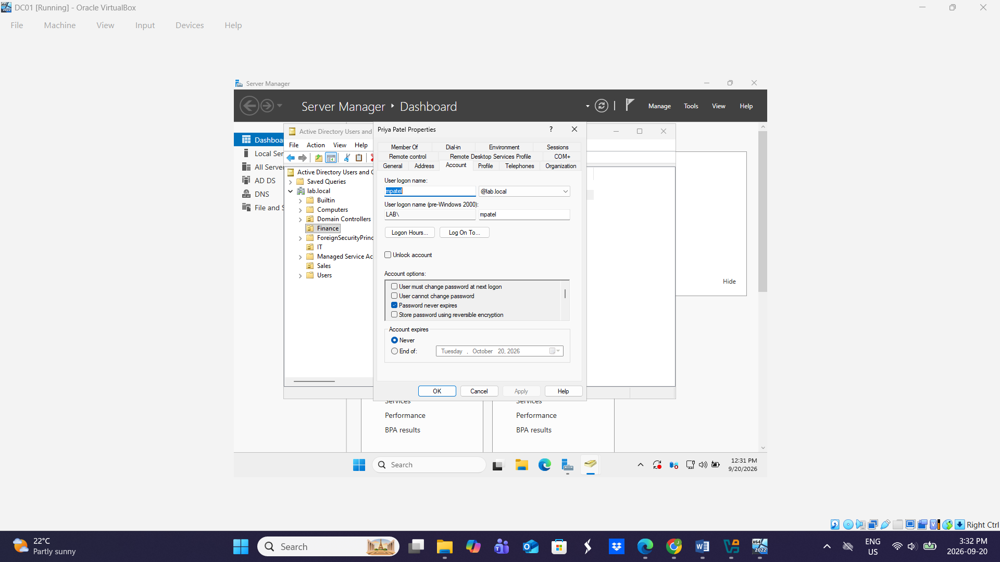
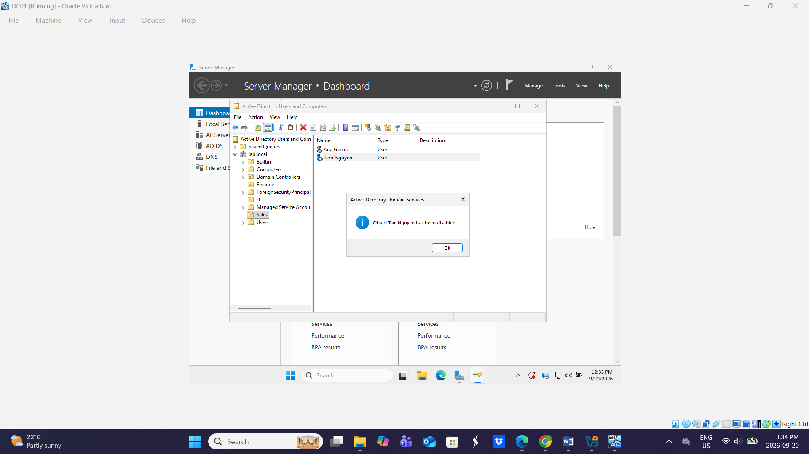

# Active Directory Home Lab — Windows Server 2025

A self-built Windows Server 2025 domain controller running on VirtualBox, configured from scratch to practise the Active Directory administration tasks handled daily by IT support and identity teams.

**Domain:** `lab.local`
**Built:** September 2026

---

## Environment

| Component | Detail |
|---|---|
| Hypervisor | Oracle VirtualBox 7.2 |
| Server OS | Windows Server 2025 Standard (Desktop Experience), 180-day evaluation |
| Resources | 4 GB RAM, 2 vCPU, 60 GB disk |
| Roles installed | Active Directory Domain Services, DNS Server |
| Forest / domain | `lab.local` (new forest, functional level default) |
| NetBIOS name | LAB |

---

## What I built

**1. Deployed the domain controller**

Installed Windows Server 2025 from ISO, installed the AD DS role, and promoted the server to the first domain controller in a new forest. DNS was installed as part of the promotion.

After the Server Manager wizard returned a role-change error, I completed the promotion through PowerShell instead:

```powershell
Install-WindowsFeature AD-Domain-Services -IncludeManagementTools
Install-ADDSForest -DomainName "lab.local" -InstallDNS
```

**2. Built an organizational structure**

Created three Organizational Units — Finance, IT and Sales — with accidental-deletion protection enabled.

**3. Created and organized user accounts**

Five domain users provisioned across the OUs following a `first-initial + surname` logon convention:

| User | Logon | OU |
|---|---|---|
| Sarah Chen | schen | Finance |
| Priya Patel | mpatel | Finance |
| James Smith | jsmith | IT |
| Ana Garcia | agarcia | Sales |
| Tam Nguyen | tnguyen | Sales |

**4. Created security groups and assigned membership**

Two global security groups — `Finance-ReadOnly` and `IT-Admins` — with users added to the group matching their department.

**5. Performed core account administration tasks**

- **Password reset** with "user must change password at next logon" enforced
- **Account unlock** via the Account tab of user properties
- **Account disable** simulating an employee departure, then re-enabled

---

## Screenshots

**Server Manager — AD DS and DNS roles active**


**OU structure in lab.local**


**Finance OU — users and security group**


**IT OU**


**Sales OU**


**Password reset with lockout status**


**Account unlock control**


**Account disabled — employee departure**


---

## What I took away from it

**DNS is not optional.** Promoting the first domain controller installs DNS because Active Directory depends on it to locate services. The delegation warning during promotion is expected on a root domain — there is no parent zone to delegate from.

**Role installation and promotion are two separate operations.** Installing AD DS only adds the binaries. The server does not become a domain controller until it is promoted, and a reboot between the two steps avoids the role-change conflict I ran into.

**The GUI is not the only path.** When the promotion wizard failed, PowerShell completed the same task in two commands. Knowing both routes matters when one of them breaks.

**OUs are containers, not groups.** An OU determines where an object lives and what Group Policy applies to it. A security group determines what an object can access. They look similar in the console and do entirely different jobs.

**Disable, don't delete.** Disabling a departing user's account preserves group memberships, file ownership and the audit trail. Deletion destroys all of it.

---

## Next steps

- Join a Windows 11 client to the domain and verify authentication
- Configure Group Policy Objects for password policy and drive mapping
- Automate user provisioning with PowerShell
- Set up an Entra ID tenant and configure hybrid identity

